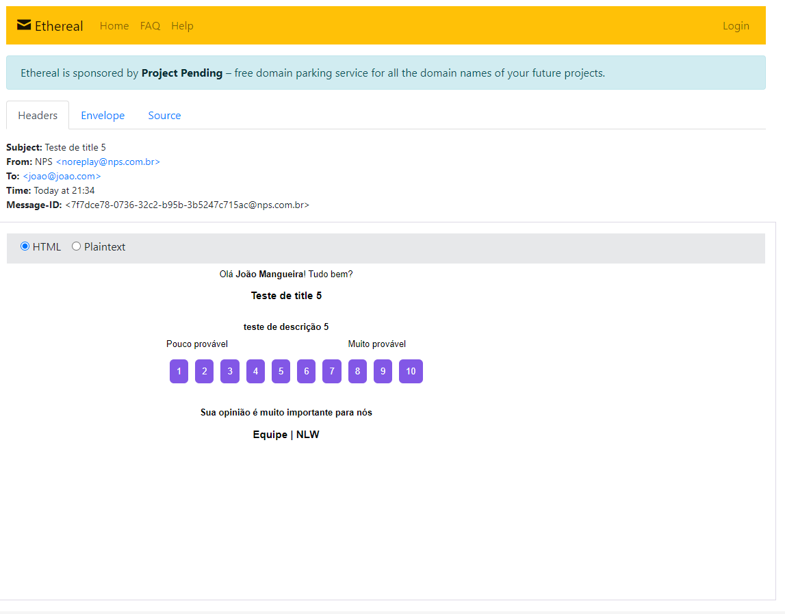

<h1 align="center">
    
</h1>

<p align="center">
  <a href="#rocket-tecnologias">Tecnologias</a>&nbsp;&nbsp;&nbsp;|&nbsp;&nbsp;&nbsp;
  <a href="#-projeto">Projeto</a>&nbsp;&nbsp;&nbsp;|&nbsp;&nbsp;&nbsp;
  <a href="#-rotas">Rotas</a>&nbsp;&nbsp;&nbsp;|&nbsp;&nbsp;&nbsp;
  <a href="#-como-rodar">Como rodar</a>&nbsp;&nbsp;&nbsp;|&nbsp;&nbsp;&nbsp;
  <a href="#-como-contribuir">Como contribuir</a>&nbsp;&nbsp;&nbsp;
</p>

<br>

# NLW #4

## 🚀 Tecnologias

Esse projeto foi desenvolvido com as seguintes tecnologias:

- [Node.js](https://nodejs.org/en/) - v14.4.0
- [Yarn](https://yarnpkg.com/) - 1.22.4
- [Npm](https://www.npmjs.com/) - 6.14.5
- [SQLite](https://www.sqlite.org/index.html) - 3.34.1


## 💻 Projeto

API para fazer pesquisas.


Email enviado usando Ethereal para o usuario votar.
<h1 align="center">
    
</h1>

## 🚀 Como Rodar

- Clone o projeto.
- Entre na pasta do projeto e rode "yarn install" (pode usar npm install de acordo com a sua configuração).
- "yarn typeorm migration:run" para rodar as migrations.
- "yarn dev" para rodar o projeto (http://localhost:3333).

## 👩🏿‍💻 Rotas

- **`POST /users`**: Rota para cadastra usuarios;
Envio
```
{
    "name": "João Mangueira6",
    "email": "joao6@joao.com"
}
```
Retorno
```
{
    "id": "5eae37d1-b5d8-4808-a944-76d83aebde51",
    "name": "João Mangueira6",
    "email": "joao6@joao.com",
    "created_at": "2021-02-28T00:28:38.000Z"
}
```

- **`GET /users`**: Rota que lista usuarios;
Retorno
```
[
    {
        "id": "d73a6f49-3e3d-4d2e-847f-09f351942f79",
        "name": "João Mangueira",
        "email": "joao@joao.com",
        "created_at": "2021-02-24T01:01:39.000Z"
    },
    {
        "id": "4341b781-58cf-420a-b5f9-19fbbb1ff78b",
        "name": "João Mangueira2",
        "email": "joao2@joao.com",
        "created_at": "2021-02-25T20:18:37.000Z"
    },
    {
        "id": "cf118d3b-2c4b-4813-a888-eb0c2f4c4af0",
        "name": "João Mangueira3",
        "email": "joao3@joao.com",
        "created_at": "2021-02-25T22:15:33.000Z"
    },
    {
        "id": "b6875363-2184-41e4-a6de-7c6136391fbf",
        "name": "João Mangueira4",
        "email": "joao4@joao.com",
        "created_at": "2021-02-25T22:23:30.000Z"
    }
]
```

- **`POST /surveys`**: Rota para cadastra pesquisas;
Envio
```
{
    "title": "Teste de title 5",
    "description": "teste de descrição 5"
}
```
Retorno
```
{
    "id": "5c821643-cef7-4661-bd05-b3bdbf1bde3c",
    "title": "Teste de title 5",
    "description": "teste de descrição 5",
    "created_at": "2021-02-27T14:50:46.000Z"
}
```

- **`GET /surveys`**: Rota que lista pesquisas;
Retorno
```
[
    {
        "id": "4c822c2b-64a3-4396-8bbc-b1c61ee07a7e",
        "title": "Teste de title",
        "description": "teste de descrição",
        "created_at": "2021-02-25T20:51:40.000Z"
    },
    {
        "id": "6abb0271-38ac-4118-b736-2901d0985f7f",
        "title": "Teste de title 2",
        "description": "teste de descrição 2",
        "created_at": "2021-02-27T14:50:28.000Z"
    }
]
```

- **`POST /sendMail`**: Rota para cadastra ligar uma pesquias a um usuario e enviar email;
Envio
```
{
    "email": "joao@joao.com",
    "survey_id": "5c821643-cef7-4661-bd05-b3bdbf1bde3c"
}
```
Retorno
```
{
    "id": "890a9e34-c2d9-4f72-b23a-187395c8b6fd",
    "user_id": "d73a6f49-3e3d-4d2e-847f-09f351942f79",
    "survey_id": "5c821643-cef7-4661-bd05-b3bdbf1bde3c",
    "created_at": "2021-02-27T15:10:33.000Z"
}
```

- **`GET /nps/:survey_id`**: Rota para calcular NPS de uma pesquisa;
Retorno
```
{
    "detractor": 2,
    "promoters": 1,
    "passive": 1,
    "totalAnswers": 4,
    "nps": "-25.00"
}
```

## 🤔 Como contribuir

- Faça um fork desse repositório;
- Cria uma branch com a sua feature: `git checkout -b minha-feature`;
- Faça commit das suas alterações: `git commit -m 'feat: Minha nova feature'`;
- Faça push para a sua branch: `git push origin minha-feature`.

Depois que o merge da sua pull request for feito, você pode deletar a sua branch.

## 📝 Licença

Esse projeto está sob a licença MIT.
